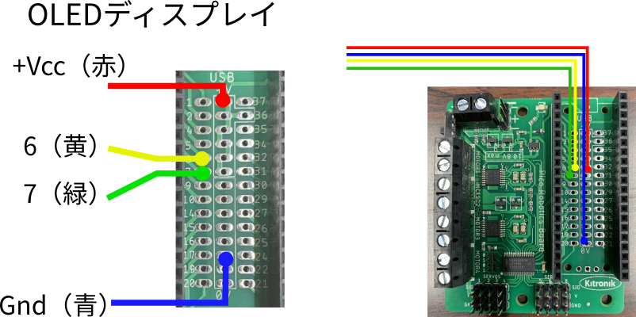

# 指定距離の走行確認

<div class="meta-info">

**Create date:** 2025-07-15  
**Modified date:** 2025-07-15

</div>

**実施日**: 2025/7/17 (Thu) 13:00 -- 14:30  

```admonish todo
**実験の様子を写真に残しておいてください**
```

## 作業分担（2名1組）
**全体（13:00-14:30）：協力作業**
- ディスプレイコネクターをハンダ付け
- ディスプレイをシャーシに固定
- 協力してプログラミング実験を実施

## 実験内容
### OLED接続


### 指定距離走行プログラミング
1. 速度制御
2. オドメトリによる走行距離制御

## 1. 指定距離走行プログラミング（時間指定）
ロボットの2個のモーターに，指定速度と指定時間だけ走行指令を出すと，
一定距離を走行します．
**走行距離を固定とし**，速度をさまざまに変化させ，制御してください．

<div style="text-align: center; font-style: italic; margin-top: 0.5em;">
    表1: モーター速度と移動距離の関係(指定距離 _______ [mm])
</div>

|指定速度(%)|指定時間(s)|実測距離(m)|
|---|---|---|
|20| | |
|50| | |
|70| | |
|100| | |


### 基本的な制御方法
```python
# MOTOR_NUM: 1, 2 で指令を出すモーターを変更
# DIRECTION: "f", "r" で正回転/逆回転を切り替え
# SPEED: 0 -- 100% でモータースピードを制御
board.motorOn(1, "f", 30)  # 左輪
board.motorOn(2, "r", 30)  # 右輪
utime.sleep_ms(2000)      # 2秒間動作
board.motorOn(1, "f", 0)  # 左輪
board.motorOn(2, "r", 0)  # 右輪
# 2秒だけ30%の速度で走行し，停止する
```

### プログラム例
```python
from machine import Pin, PWM, reset, time_pulse_us, I2C
import PicoRobotics
import utime
import ssd1306
import time
import math


# ロボットの諸定数
WHEEL_RADIUS = 
GEAR_RATIO = 
ENCODER_PPR = 
PI = math.pi
DISTANCE_PER_PULSE = 

# --- ディスプレイの設定
i2c = I2C(1, sda=Pin(6), scl=Pin(7))
try:
    display = ssd1306.SSD1306_I2C(128, 64, i2c)
except:
    print("Display Error")
    
display.fill(0)  # ディスプレイをクリア
display.text("Set up done", 0, 0)
display.show()  # ディスプレイに表示

# --- エンコーダ読み取り用変数
count_L = 0
last_state_L = 0

count_R = 0
last_state_R = 0

# --- ボードとモーター設定
board = PicoRobotics.KitronikPicoRobotics()
directions = ["r", "f"]

# --- エンコーダピン（AB相）
pin_a = Pin(16, Pin.IN, Pin.PULL_UP)
pin_b = Pin(15, Pin.IN, Pin.PULL_UP)

pin_c = Pin(10, Pin.IN, Pin.PULL_UP)
pin_d = Pin(11, Pin.IN, Pin.PULL_UP)

# --- 現在の状態をビットで取得（00〜11）
def read_encoder_L_state():
    return (pin_a.value() << 1) | pin_b.value()

def read_encoder_R_state():
    return (pin_c.value() << 1) | pin_d.value()

# --- 割り込み処理（両相変化対応）
def encoder_L_callback(pin):
    global count_L, last_state_L
    new_state = read_encoder_L_state()
    transition = (last_state_L << 2) | new_state
    # 有効な状態遷移パターンで方向を判断（グレイコード順）
    if transition in [0b0001, 0b0111, 0b1110, 0b1000]:  # 正方向
        count_L += 1
    elif transition in [0b0010, 0b0100, 0b1101, 0b1011]:  # 逆方向
        count_L -= 1
    # その他（グリッチ）は無視
    last_state_L = new_state
    
def encoder_R_callback(pin):
    global count_R, last_state_R
    new_state = read_encoder_R_state()
    transition = (last_state_R << 2) | new_state
    # 有効な状態遷移パターンで方向を判断（グレイコード順）
    if transition in [0b0001, 0b0111, 0b1110, 0b1000]:  # 正方向
        count_R += 1
    elif transition in [0b0010, 0b0100, 0b1101, 0b1011]:  # 逆方向
        count_R -= 1
    # その他（グリッチ）は無視
    last_state_R = new_state

# --- 初期状態を保存
last_state_L = read_encoder_L_state()
last_state_R = read_encoder_R_state()


# --- 割り込み設定（両エッジ両ピン）
pin_a.irq(trigger=Pin.IRQ_RISING | Pin.IRQ_FALLING, handler=encoder_L_callback)
pin_b.irq(trigger=Pin.IRQ_RISING | Pin.IRQ_FALLING, handler=encoder_L_callback)

pin_c.irq(trigger=Pin.IRQ_RISING | Pin.IRQ_FALLING, handler=encoder_R_callback)
pin_d.irq(trigger=Pin.IRQ_RISING | Pin.IRQ_FALLING, handler=encoder_R_callback)
# --- テストループ
last_print = utime.ticks_ms()

board.motorOn(1, "f", 0)
board.motorOn(2, "f", 0)

def display_shell(count_L, count_R, speed):
    print("CountL:", count_L, " speed:", speed)
    print("CountR:", count_R, " speed:", speed)
    
def display_show(count_L, count_R):
    display.text("CountL: {}".format(count_L), 0, 20)
    display.text("CountR: {}".format(count_R), 0, 30)
    dist = count_R * DISTANCE_PER_PULSE
    display.text("DIST: {}".format(dist), 0, 40)
    
def calc_dist(count_L, count_R):
    return count_R * DISTANCE_PER_PULSE

LIMIT_DIST = 1.0  #走行距離指定
speed = 100

while True:
    now = utime.ticks_ms()
    if utime.ticks_diff(now, last_print) > 100:
        display.fill(0)  # ディスプレイをクリア
        display_shell(count_L, count_R, speed)
        display_show(count_L, count_R)
        display.show()  # ディスプレイに表示

        last_print = now
        
    # ここをN秒走行に変える
    
    # ここまで

board.motorOn(1, "f", 0)
board.motorOn(2, "f", 0)
display.fill(0)  # ディスプレイをクリア
display_measurement(distance)
display_shell(count_L, count_R, speed)
display_show(count_L, count_R)
display.show()  # ディスプレイに表示
```


## 2. オドメトリによる走行距離制御
オドメトリとは，タイヤの回転数から走行距離（2輪独立制御の場合は位置と方向）を計算で求めたものです．
計算に必要なパラメーターは次のようになります．

- エンコーダーパルス（カウント）あたりのタイヤの回転数
- タイヤの半径
- ギヤ比
- 回転時間（何秒間走行させるか）

### オドメトリ計算用定数
プログラムでは以下の定数を定義して使用します：

```python
# オドメトリ計算用定数
WHEEL_RADIUS = 
GEAR_RATIO = 
ENCODER_PPR = 
DISTANCE_PER_PULSE = 
```
<!--
WHEEL_RADIUS = 0.034        # [m]
GEAR_RATIO = 56
ENCODER_PPR = 11            # [pulses/revolution]
DISTANCE_PER_PULSE = (2 * 3.14159 * WHEEL_RADIUS) / (GEAR_RATIO * ENCODER_PPR)
-->

これにより，1カウントあたりの走行距離は，次のようになります．

$$
\text{走行距離/カウント} = \frac{\text{エンコーダーカウント} \times 2\pi \times \text{WHEEL\_RADIUS}}{\text{GEAR\_RATIO} \times \text{ENCODER\_PPR}}
$$

<!--
ここで：
- WHEEL_RADIUS：タイヤ半径 = 0.034 [m]
- GEAR_RATIO：ギヤ比 = 56
- ENCODER_PPR：エンコーダー分解能 = 22 [パルス/回転]

具体的な数値を代入すると：

$$
\text{走行距離} = \text{エンコーダーカウント} \times \text{DISTANCE\_PER\_PULSE} = \text{エンコーダーカウント} \times 0.0001734 \text{ [m]}
$$
-->

```python
import PicoRobotics
import utime
from machine import Pin, PWM, reset, time_pulse_us, I2C
import ssd1306
import time

# --- ディスプレイの設定
i2c = I2C(1, sda=Pin(6), scl=Pin(7))
try:
    display = ssd1306.SSD1306_I2C(128, 64, i2c)
except:
    print("Display Error")
    
display.fill(0)  # ディスプレイをクリア
display.text("Set up USonic", 0, 0)
display.show()  # ディスプレイに表示

# --- エンコーダ読み取り用変数
count = 0
last_state = 0

count_R = 0
last_state_R = 0

# --- ボードとモーター設定
board = PicoRobotics.KitronikPicoRobotics()
directions = ["r", "f"]

# --- エンコーダピン（AB相）
pin_a = Pin(16, Pin.IN, Pin.PULL_UP)
pin_b = Pin(15, Pin.IN, Pin.PULL_UP)

pin_c = Pin(10, Pin.IN, Pin.PULL_UP)
pin_d = Pin(11, Pin.IN, Pin.PULL_UP)

# --- 現在の状態をビットで取得（00〜11）
def read_encoder_state():
    return (pin_a.value() << 1) | pin_b.value()

def read_encoder_R_state():
    return (pin_c.value() << 1) | pin_d.value()

# --- 割り込み処理（両相変化対応）
def encoder_callback(pin):
    global count, last_state
    new_state = read_encoder_state()
    transition = (last_state << 2) | new_state
    # 有効な状態遷移パターンで方向を判断（グレイコード順）
    if transition in [0b0001, 0b0111, 0b1110, 0b1000]:  # 正方向
        count += 1
    elif transition in [0b0010, 0b0100, 0b1101, 0b1011]:  # 逆方向
        count -= 1
    # その他（グリッチ）は無視
    last_state = new_state
    
def encoder_R_callback(pin):
    global count_R, last_state_R
    new_state = read_encoder_R_state()
    transition = (last_state_R << 2) | new_state
    # 有効な状態遷移パターンで方向を判断（グレイコード順）
    if transition in [0b0001, 0b0111, 0b1110, 0b1000]:  # 正方向
        count_R += 1
    elif transition in [0b0010, 0b0100, 0b1101, 0b1011]:  # 逆方向
        count_R -= 1
    # その他（グリッチ）は無視
    last_state_R = new_state

# --- 初期状態を保存
last_state = read_encoder_state()
last_state_R = read_encoder_R_state()


# --- 割り込み設定（両エッジ両ピン）
pin_a.irq(trigger=Pin.IRQ_RISING | Pin.IRQ_FALLING, handler=encoder_callback)
pin_b.irq(trigger=Pin.IRQ_RISING | Pin.IRQ_FALLING, handler=encoder_callback)

pin_c.irq(trigger=Pin.IRQ_RISING | Pin.IRQ_FALLING, handler=encoder_R_callback)
pin_d.irq(trigger=Pin.IRQ_RISING | Pin.IRQ_FALLING, handler=encoder_R_callback)
# --- テストループ
last_print = utime.ticks_ms()

board.motorOn(1, "f", 0)
board.motorOn(2, "f", 0)

while True:
    speed = 0
    while speed < 100:
        speed += 1
        board.motorOn(1, "f", speed)
        board.motorOn(2, "f", speed)

        utime.sleep_ms(10)
        # 出力を制限（100msごと）
        now = utime.ticks_ms()
        if utime.ticks_diff(now, last_print) > 100:
            print("Count:", count, " speed:", speed)
            last_print = now
            display.fill(0)  # ディスプレイをクリア
            display.text("Count: {}".format(count), 0, 20)
            display.show()  # ディスプレイに表示
    while count > -3000:
        speed = 100
        board.motorOn(1, "f", speed)
        board.motorOn(2, "f", speed)

        utime.sleep_ms(10)
        # 出力を制限（100msごと）
        now = utime.ticks_ms()
        if utime.ticks_diff(now, last_print) > 100:
            print("Count:", count, " speed:", speed)
            last_print = now
            display.fill(0)  # ディスプレイをクリア
            display.text("Count: {}".format(count), 0, 20)
            display.show()  # ディスプレイに表示
    while speed > 0:
        speed -= 1
        board.motorOn(1, "f", speed)
        board.motorOn(2, "f", speed)

        utime.sleep_ms(20)
        now = utime.ticks_ms()
        if utime.ticks_diff(now, last_print) > 100:
            print("Count:", count, " speed:", speed)
            last_print = now
            display.fill(0)  # ディスプレイをクリア
            display.text("Count: {}".format(count), 0, 20)
            display.show()  # ディスプレイに表示

    break
board.motorOn(1, "f", 0)
board.motorOn(2, "f", 0)
```


---

## トラブルシューティング

### モーター制御でエラーが発生する場合

#### OSError: [Errno 5] EIO エラー
**症状：** `board.motorOn()`実行時にI/Oエラーが発生

**主な原因と対処法：**
1. **金属部品のショート**
   - エンコーダー基板周辺でネジなどの金属部品が吸着していないか確認
   - 異物を除去し，金属部品が基板に接触していないことを確認

2. **配線の問題**
   - モーター配線が正しく接続されているか確認
   - 配線の断線や接触不良がないか確認

3. **電源の問題**
   - バッテリー残量を確認
   - 電源供給が安定しているか確認

#### 超音波センサーで異常な値が表示される場合
**症状：** 距離測定で`None`や異常に大きな値が返される

**対処法：**
- センサー前方に障害物がないか確認
- TRIGピン，ECHOピンの配線確認
- センサーの向きが正しいか確認

#### プログラムが途中で停止する場合
**対処法：**
- エラーメッセージを確認し，該当するエラーの対処法を実施
- ハードウェアの接続状態を再確認
- プログラムを最初から再実行

