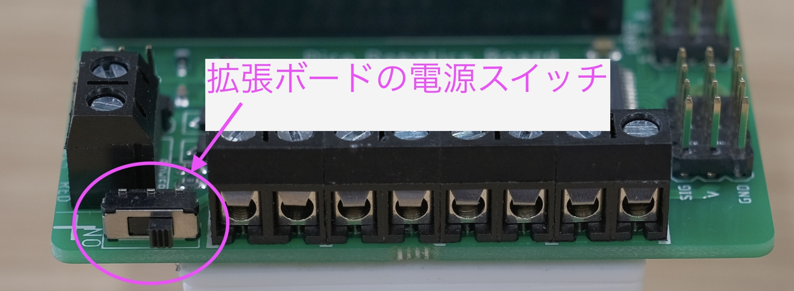

# ロボット制御基礎手順書

2025/7/10 (Thu) 13:00 -- 14:30  
**実験の様子を写真に残しておいてください**

## 作業分担（2名1組）
**全体（13:00-14:30）：協力作業**
- 協力してプログラミング実験を実施

## 実験内容
1. ロボットの前進・後退制御
2. 超音波センサーを使ったモーターのON/OFF 制御
3. 前方障害物手前での停止処理

---

## 1. ロボットの前進・後退制御
ロボットは2個のモーターで左右の車輪を制御します．両方のタイヤが正しく前進・後退方向に回転するようにしてください．

### 基本的な制御方法
```python
board.motorOn(MOTOR_NUM, DIRECTION, SPEED)
# MOTOR_NUM: 1, 2 で指令を出すモーターを変更
# DIRECTION: "f", "r" で正回転/逆回転を切り替え
# SPEED: 0 -- 100% でモータースピードを制御
```

### 独立二輪駆動制御の考え方
ロボットの前進・後退は，左右のモーターの回転方向の組み合わせで決まります．
**配線の向きによって，前進に必要な回転方向の組み合わせが異なります**．

**想定される組み合わせパターン：**
- パターン1：`motor1="f", motor2="r"`
- パターン2：`motor1="f", motor2="f"`
- パターン3：`motor1="r", motor2="r"`
- パターン4：`motor1="r", motor2="f"`

**f**: forward (CW，時計回り，正転)<br>
**r**: reverse (CCW，反時計回り，逆転)<br>
どちらが正転になるかはモーターによります．


### 実験手順
1. **事前準備**
    - バッテリーを接続する 
    - **拡張ボードのスライドスイッチをONにする**（モーター動作に必要）
   
   
   
    - 安全な場所で実験を行う

3. **前進方向の確認**
    - 下記の[パターン確認プログラム](#patterncheck)を実行する
   - 各パターンを試し，ロボットが前進する組み合わせを見つける
   - 前進が確認できたら，後退（逆の組み合わせ）も確認

2. **テスト用プログラムの作成**
    - 下記の[Hintプログラム](#hintmotor)を参考に，両輪を同時に制御するプログラムを作成
    - まず`SPEED = 30`程度の低速で動作確認

4. **速度の調整**
   - 前進・後退の組み合わせが確定したら，いろいろな速度を試す
   - 例：`SPEED = 50`（制御しやすいかもしれない速度）

5. **実験終了**
   - **実験終了時は，スライドスイッチをOFFにする**

**注意事項：**
- **モーター実験前に必ずスライドスイッチをON，実験後にOFFにする**
- 必ず低速（30以下）から開始し，安全を確認してから速度を上げる
- ロボットが予期しない方向に動いた場合は，すぐに停止する
- 各グループで配線状態が異なる可能性があるため，必ず実際に動作確認を行う
- エラーが発生した場合は[トラブルシューティング](#トラブルシューティング)を参照

<a id="patterncheck"></a>

### 前進・後退パターン確認プログラム
4つの組み合わせパターンを順番にテストして，どのパターンで前進するかを確認してください．

```python
import PicoRobotics
import utime

# --- ボードとモーター設定
board = PicoRobotics.KitronikPicoRobotics()

# 初期状態：両輪停止
board.motorOn(1, "f", 0)
board.motorOn(2, "f", 0)

# --- 前進・後退のテスト
print("前進・後退テスト開始")

# パターン1: motor1="f", motor2="r" を試す
print("パターン1: motor1=f, motor2=r")
board.motorOn(1, "f", 30)  # 左輪
board.motorOn(2, "r", 30)  # 右輪
utime.sleep_ms(2000)      # 2秒間動作

# 停止
board.motorOn(1, "f", 0)
board.motorOn(2, "f", 0)
utime.sleep_ms(1000)      # 1秒間停止

# パターン2: motor1="f", motor2="f" を試す
print("パターン2: motor1=f, motor2=f")
board.motorOn(1, "f", 30)
board.motorOn(2, "f", 30)
utime.sleep_ms(2000)

# 停止
board.motorOn(1, "f", 0)
board.motorOn(2, "f", 0)
utime.sleep_ms(1000)

# パターン3: motor1="r", motor2="r" を試す
print("パターン3: motor1=r, motor2=r")
board.motorOn(1, "r", 30)
board.motorOn(2, "r", 30)
utime.sleep_ms(2000)

# 停止
board.motorOn(1, "f", 0)
board.motorOn(2, "f", 0)
utime.sleep_ms(1000)

# パターン4: motor1="r", motor2="f" を試す
print("パターン4: motor1=r, motor2=f")
board.motorOn(1, "r", 30)
board.motorOn(2, "f", 30)
utime.sleep_ms(2000)

# 最終停止
board.motorOn(1, "f", 0)
board.motorOn(2, "f", 0)
print("テスト完了")
```

<a id="hintmotor"></a>

### Hint: モーターの回転制御プログラム

前進パターンが分かったら，以下の雛形を使って指定秒だけ前進するプログラムを作成してください．

```python
import PicoRobotics
import utime

# --- ボードとモーター設定
board = PicoRobotics.KitronikPicoRobotics()

# 初期状態：両輪停止
board.motorOn(1, "f", 0)
board.motorOn(2, "f", 0)

# --- 前進設定（確認プログラムで見つけたパターンを使用）
MOTOR1_DIR = "f"  # 前進時のモーター1の方向（"f"または"r"に設定）
MOTOR2_DIR = "r"  # 前進時のモーター2の方向（"f"または"r"に設定）
SPEED = 50        # モーター速度（0-100）
FORWARD_TIME = 3000  # 前進時間（ミリ秒）

# --- 前進動作
print("前進開始")
board.motorOn(1, MOTOR1_DIR, SPEED)
board.motorOn(2, MOTOR2_DIR, SPEED)
utime.sleep_ms(FORWARD_TIME)

# --- 停止
board.motorOn(1, "f", 0)
board.motorOn(2, "f", 0)
print("停止")
```

## 2. 超音波センサーを使ったモーターのON/OFF 制御
車体前方に設置した超音波センサーで，前方の障害物までの距離を読み取ってください．
障害物判定をする距離を，ここでは`DIST_OBS`と呼ぶことにします．

### 超音波センサーの接続について
**重要：コネクター接続時は端子の役割を必ず合わせてください**

超音波センサーには4つの端子があります：
- **VCC**: 電源（3.3V）- 赤線
- **TRIG**: トリガー信号（GP0/Pin 0に接続）- 黄線
- **ECHO**: エコー信号（GP1/Pin 1に接続）- 白線
- **GND**: グラウンド - 黒線

**接続手順：**
1. センサー側とボード側のコネクター端子配置を確認
2. 線の色と役割を確認：赤（VCC-3.3V），黄（TRIG-GP0），白（ECHO-GP1），黒（GND）
3. 逆接続すると故障の原因となるため，接続前に必ず確認

### DIST_OBSの値設定について
**推奨値：`DIST_OBS = 20`（cm）**

値の設定における検討事項：
- **安全性**：ロボットが障害物に衝突する前に十分な余裕を持って停止できる
- **センサー特性**：超音波センサーは近距離（5cm未満）では正確な測定が困難
- **実験環境**：テーブル上での実験に適した距離で，壁や机の端を適切に検出可能
- **反応時間**：モーターの停止やプログラムの処理時間を考慮した安全マージン

**実験手順：**
1. まず`DIST_OBS = 20`で動作確認
2. 動作が安定したら，10cm，30cmなど異なる値で動作の違いを観察
3. 最適な値を各グループで検討

`DIST_OBS`の値を設定し，計測距離とそれを比較して，
障害物が前方になければモーターを回転，そうでなければ停止としてください．

### プログラミング課題
以下の2つのHintプログラムを参考にして，**超音波センサーとモーター制御を組み合わせた完成プログラム**を作成してください．

**課題の要求仕様：**
1. 超音波センサーで前方の距離を測定
2. 測定距離が`DIST_OBS`より大きい場合：モーターを回転（前進）
3. 測定距離が`DIST_OBS`以下の場合：モーターを停止
4. 上記の処理を繰り返し実行

**プログラム作成手順：**
1. **前進パターンの確認**
   - 「## 1」で確定した前進パターンを確認（MOTOR1_DIR, MOTOR2_DIR）
   
2. **基本構造の準備**
   - 「Hint: モーターの回転制御プログラム」のimport部分とboard設定をコピー
   - 「Hint: 超音波センサー距離計測プログラム」のmeasure_distance()関数をコピー
   - 「Hint: 超音波センサー距離計測プログラム」のピン設定（TRIG, ECHO）をコピー

3. **統合プログラムの作成**
   - `DIST_OBS = 20`を設定
   - 前進パターンを変数で設定（MOTOR1_DIR, MOTOR2_DIR）
   - while文でループ処理を作成
   - 条件分岐で距離に応じたモーター制御を実装

4. **動作確認**
   - 障害物なしの状態で前進するかテスト
   - 障害物ありの状態で停止するかテスト

**具体的な統合のポイント：**
- **measure_distance()関数**：超音波センサーHintから全体をコピー
- **ピン設定**：TRIG = Pin(0, Pin.OUT), ECHO = Pin(1, Pin.IN)
- **前進制御**：「## 1」で確定したパターンを使用
- **ループ制御**：while文でutime.sleep_ms(100)程度の間隔で繰り返し

**エラー処理について：**
`distance`が`None`の場合は，安全のためモーターを停止する
```python
# ## 1で確定した前進パターンを使用
MOTOR1_DIR = "f"  # 前進時のモーター1方向（実際の値に変更）
MOTOR2_DIR = "r"  # 前進時のモーター2方向（実際の値に変更）
SPEED = 50

distance = measure_distance()
if distance is None:
    # 測定失敗時は停止
    board.motorOn(1, "f", 0)
    board.motorOn(2, "f", 0)
else:
    # 通常の距離判定処理
    if distance > DIST_OBS:
        # 前進
        board.motorOn(1, MOTOR1_DIR, SPEED)
        board.motorOn(2, MOTOR2_DIR, SPEED)
    else:
        # 停止
        board.motorOn(1, "f", 0)
        board.motorOn(2, "f", 0)
```

### 統合プログラムのヒント
以下の雛形を参考に，統合プログラムを作成してください．

```python
# ここにimport文を書く（PicoRobotics, utime, machine関連）

# ここに超音波センサー距離計測関数をコピー
def measure_distance():
    # 超音波センサーHintから全体をコピー
    pass

# ここにピン設定をコピー（TRIG, ECHO）

# ここにボード設定を書く（PicoRobotics.KitronikPicoRobotics()）

# 初期状態：両輪停止
# ここにモーター停止命令を書く

# 設定値
DIST_OBS = 20  # 障害物判定距離（cm）
MOTOR1_DIR = "f"  # 前進時のモーター1方向（## 1の結果に変更）
MOTOR2_DIR = "r"  # 前進時のモーター2方向（## 1の結果に変更）
SPEED = 50

# メインループ
MAX_RUN_COUNT = 1000
count = 0

while count < MAX_RUN_COUNT:
    # ここで距離を測定
    # distance = measure_distance()
    
    # ここでエラー処理（distance is None）
    if distance is None:
        # 測定失敗時：両輪停止
        pass
    else:
        # 通常の距離判定
        if distance > DIST_OBS:
            # 前進：両輪を前進パターンで回転
            pass
        else:
            # 停止：両輪停止
            pass
    
    # ここで短い待機時間
    # utime.sleep_ms(100)
    
    count += 1

# 最終停止
# ここに最終的な両輪停止命令を書く
```

### Hint: 超音波センサー距離計測プログラムのサンプル
```python
# 超音波センサー距離計測実験プログラム
import utime
from machine import Pin, PWM, reset, time_pulse_us, I2C
import time

#======<ここから超音波センサーの準備として必要>=====
def measure_distance():
    # Trigピンを10us HIGHにする
    TRIG.value(1)
    time.sleep_us(10)
    TRIG.value(0)
    
    # EchoピンのHIGHパルスの長さを計測
    duration = time_pulse_us(ECHO, 1, 30000)  # タイムアウト: 30ms
    
    # タイムアウト時の処理
    if duration < 0:
        return None  # 測定失敗

    # 音速を340 m/sと仮定して距離を計算
    distance = (duration * 0.0343) / 2  # 単位: cm
    
    return distance

# 超音波センサーの設定
# - TrigとEchoピンの設定
TRIG = Pin(0, Pin.OUT)
ECHO = Pin(1, Pin.IN)
# - TrigピンをLOWに設定しておく
TRIG.value(0)
utime.sleep_ms(2000)
#======<ここまで>=====

#======<超音波センサーの使い方>=====
distance = measure_distance()
print("Dist : {} cm".format(float(distance)))
utime.sleep_ms(10)
#======<ここまで>=====
```

## 3. 前方障害物手前での停止処理
「## 2」で作成したプログラムを使用して，実際の動作確認を行います．

### 実験手順
1. **安全な場所でテスト**：床またはテーブル上で実施
2. **障害物の設置**：本，箱などをロボットの前方に配置
3. **プログラム実行**：作成したプログラムを実行し，停止動作を確認
4. **距離の調整**：必要に応じてDIST_OBSの値を調整

### 確認ポイント
- 障害物手前で確実に停止するか
- 障害物がない時は前進するか

---

## トラブルシューティング

### モーター制御でエラーが発生する場合

#### OSError: [Errno 5] EIO エラー
**症状：** `board.motorOn()`実行時にI/Oエラーが発生

**主な原因と対処法：**
1. **金属部品のショート**
   - エンコーダー基板周辺でネジなどの金属部品が吸着していないか確認
   - 異物を除去し，金属部品が基板に接触していないことを確認

2. **配線の問題**
   - モーター配線が正しく接続されているか確認
   - 配線の断線や接触不良がないか確認

3. **電源の問題**
   - バッテリー残量を確認
   - 電源供給が安定しているか確認

#### 超音波センサーで異常な値が表示される場合
**症状：** 距離測定で`None`や異常に大きな値が返される

**対処法：**
- センサー前方に障害物がないか確認
- TRIGピン，ECHOピンの配線確認
- センサーの向きが正しいか確認

#### プログラムが途中で停止する場合
**対処法：**
- エラーメッセージを確認し，該当するエラーの対処法を実施
- ハードウェアの接続状態を再確認
- プログラムを最初から再実行

