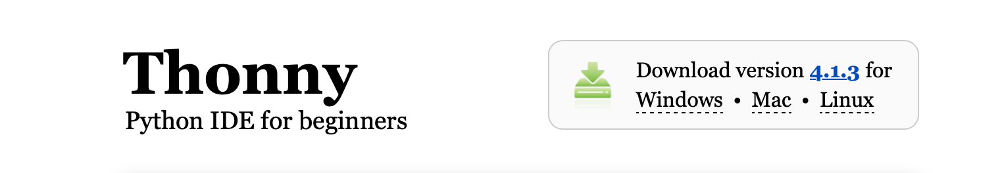
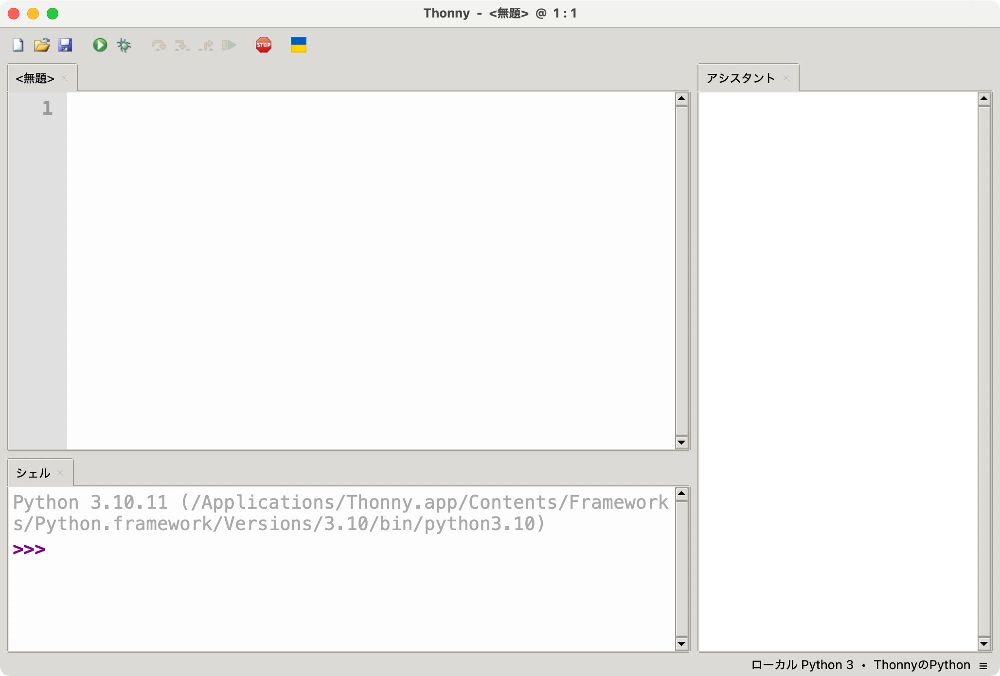
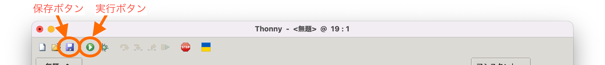

# Thonnyをインストール

## Thonnyとは
[Thonny](https://thonny.org/)は，Windows，Mac，Linuxで共通に使えるPython言語の実行環境を提供するアプリケーションです．

[Thonny, Python IDE for beginners](https://thonny.org/)

## インストール方法

- ブラウザから`https://thonny.org/`にアクセスする
- [Thonny](https://thonny.org/)のトップページ（以下の画像）にOSごとにインストール方法が提供されている．該当するOS上にマウスカーソルを移動させると，ダウンローダが表示されるので，実行する．
    

    
## 起動画面

- Thonnyを起動すると，次のようなウィンドウが出る．左上のエリアがプログラミングをするところ（エディタ）．実行結果は下のシェルに出たり，別のウィンドウが表示されたりする．
    

    

## テストプログラムの確認

- 以下のプログラムを入力し，実行してみる．#記号の行は，コメントなので入力しなくてもよい．
    
```python
# Hello, World! を表示するプログラム
print("Hello, World!")
```


    
- 下側のシェルに結果（ `Hello, World!` という文字列）が表示されれば成功．

**実行の様子**

<video controls poster="../images/teaching-result-movie-face.png" style="width: 100%; height: auto;">
  <source src="../images/teaching-result-movie.mov"
</video>
