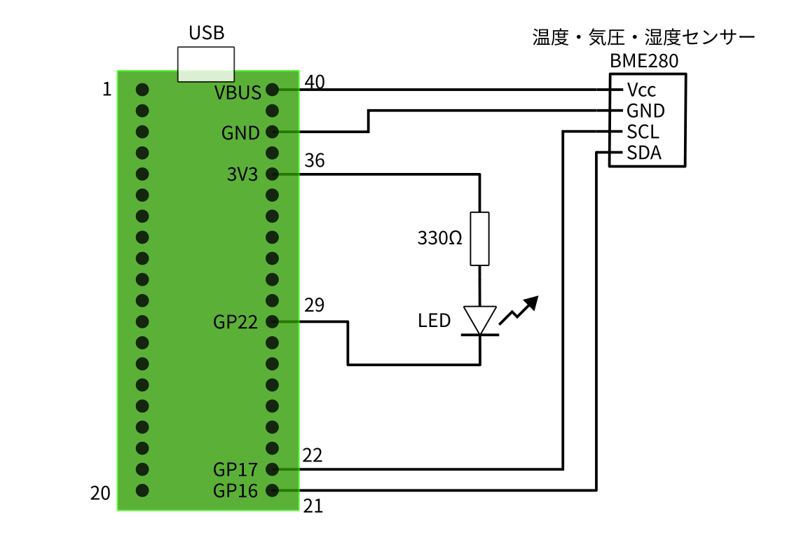
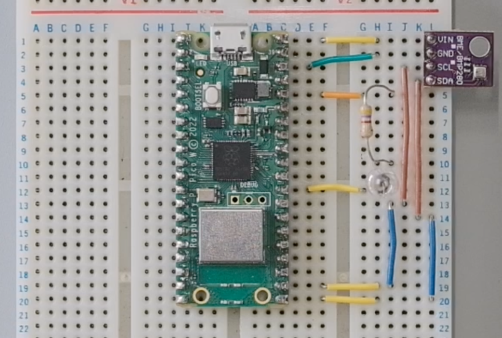

# 講義ノート1回目

<div class="meta-info">

**Create date:** 2025-07-11  
**Modified date:** 2025-07-11

</div>

2025/7/15 (Tue) 16:20 -- 17:50  
**実験の様子を写真に残しておいてください**

## 大きな目標設定
- IoTの基礎をマイコンプログラミングを通して学ぶ
- Pythonの文法を知る
- インターネット通信の仕組みを知る

## 実験内容
1. ブレッドボードで温度センサー計測回路を組み立てる
1. 温度センサーをRaspberryPi Pico で読み取る
2. センサー値をOLEDで表示する
2. 計測データをファイルに保存してPCでグラフにする

## 1. ブレッドボードで温度センサー計測回路を組み立てる
### 配線図


### 完成図


## 2. 温度センサーをRaspberryPi Pico で読み取る
### センサー利用のためのPythonモジュールをセット
1. 以下のURLにブラウザでアクセスする  
[GitHub - robert-hh/BME280: Micropython driver for the BME280 sensor](https://github.com/robert-hh/BME280/tree/master)
    
2. 今回使うモジュール名をクリックする  

    
3. モジュールのソースコードをコピーボタンでコピーする  

    
4. Thonnyで新しいファイルを作成し，先ほどコピーしたソースコードをペーストする  

    
5. ThonnyからPicoを認識させる
6. Picoに `bme280_float.py` という名前で保存する  
  
  
  

### センサーからデータ読み取り

1. 以下のプログラムをThonny上に書き，Picoで実行する
```python
from machine import I2C, Pin
import bme280_float as bme280
import time

i2c = I2C(0, scl=Pin(17), sda=Pin(16), freq=100000)
print(i2c.scan())  # [118] または [119] なら正常

bme = bme280.BME280(i2c=i2c)

led = Pin(22, Pin.OUT) # LEDについてはなくても問題ない
led.value(1)           # 

while True:
    # 気温，気圧，湿度を読み取る
    temp, pres, hum = bme.read_compensated_data()
    print('気温: {:.2f}°C  気圧: {:.2f}hPa  湿度: {:.2f}%'.format(temp, pres / 100, hum))

    # (オプション）気温が25度を超えたらLEDを点灯させる
    if temp > 25.0:
        led.value(0)
    else:
        led.value(1)

    # 1秒間隔で計測を続ける
    time.sleep(1)
```
    
2. シェルに以下のような表示が出たら成功．LEDを繋いでいる場合，気温25度を超えると点灯する（点灯を判断する数値は適当を変えてよい）
  <video controls poster="./images/温度センサー読み取り_preview.png"
  style="width: 100%; height: auto;">
    <source src="./images/温度センサー読み取り.mov"
  </video>
