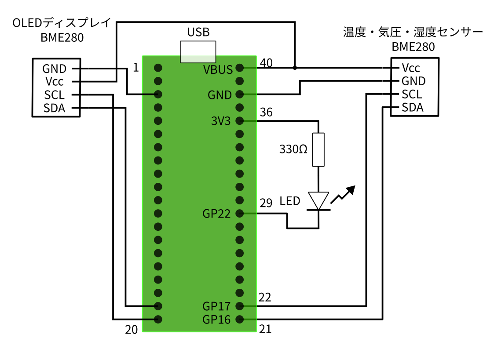
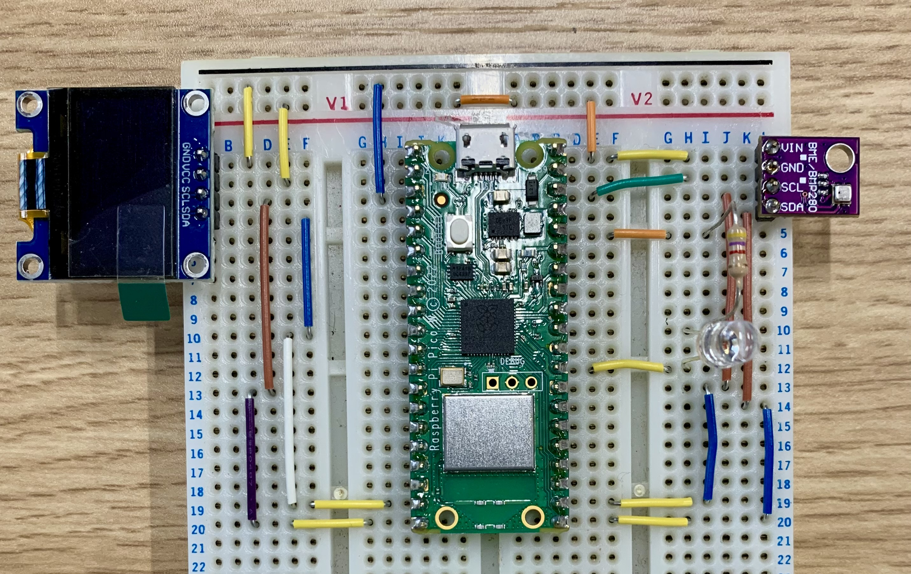
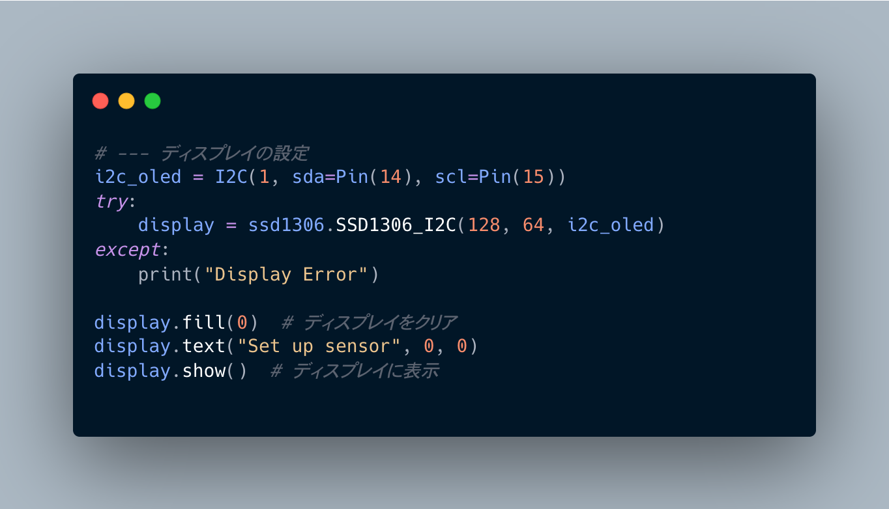
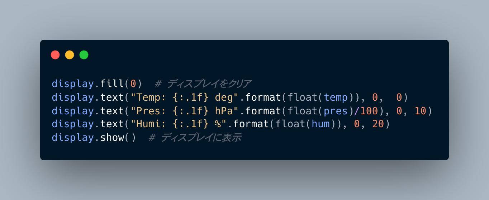
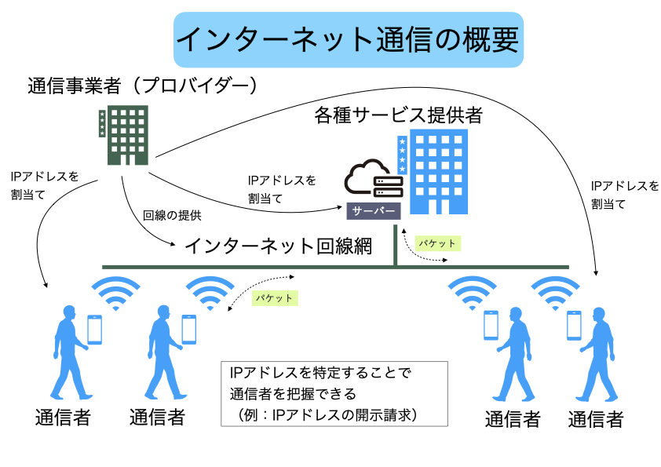

# 講義ノート2回目

<div class="meta-info">

**Create date:** 2025-07-21  
**Modified date:** 2025-07-21

</div>

```admonish info
2025/7/21 (Mon) 13:00 -- 14:30  
**実験の様子を写真に残しておいてください**
```

## 大きな目標設定
- IoTの基礎をマイコンプログラミングを通して学ぶ
- Pythonの文法を知る
- インターネット通信の仕組みを知る

## 実験内容
2. 温度センサーをRaspberryPi Pico で読み取る
3. センサー値をOLEDディスプレイで表示する
4. 計測データをWiFiでPCへ送信し，PCで受信する

## 1. センサー値をOLEDディスプレイで表示する
### 配線図

### 完成図

### OLED表示付きプログラム

**プログラムの雛形**
```python
from machine import Pin, PWM, reset, time_pulse_us, I2C
import ssd1306
import time
import bme280_float as bme280

i2c_bme = I2C(0, scl=Pin(17), sda=Pin(16), freq=100000)
print(i2c_bme.scan())  # [118] または [119] なら正常

bme = bme280.BME280(i2c=i2c_bme)

led = Pin(22, Pin.OUT) # LEDについてはなくても問題ない
led.value(1)           # 

#=====<ここにディスプレイの初期設定を書く>=====

#=====<ここまで>=====

# --- 計測開始
while True:
    # 気温，気圧，湿度を読み取る
    temp, pres, hum = bme.read_compensated_data()
    print('気温: {:.2f}°C  気圧: {:.2f}hPa  湿度: {:.2f}%'.format(temp, pres / 100, hum))

    # (オプション）気温が25度を超えたらLEDを点灯させる
    if temp > 25.0:
        led.value(0)
    else:
        led.value(1)

    #=====<ここにディスプレイ表示処理を書く>=====

    #=====<ここまで>=====

    # 1秒間隔で計測を続ける
    time.sleep(1)


```

**ディスプレイの初期設定**

<!--
```python
# --- ディスプレイの設定
i2c_oled = I2C(1, sda=Pin(14), scl=Pin(15))
try:
    display = ssd1306.SSD1306_I2C(128, 64, i2c_oled)
except:
    print("Display Error")
    
display.fill(0)  # ディスプレイをクリア
display.text("Set up sensor", 0, 0)
display.show()  # ディスプレイに表示
```
-->

**ディスプレイの表示処理**

<!--
```python
display.fill(0)  # ディスプレイをクリア
display.text("Temp: {:.1f} deg".format(float(temp)), 0,  0)
display.text("Pres: {:.1f} hPa".format(float(pres)/100), 0, 10)
display.text("Humi: {:.1f} %".format(float(hum)), 0, 20)
display.show()  # ディスプレイに表示
```
-->

<!--
```python
{{#include oled.py}}
```
-->

### 課題
設定温度よりも気温が高かったら，`Hot!!`，そうでなければ`Comfortable`と表示する処理を追加しよう．

## 2. インターネット通信の仕組み
### 2.1 一般的な説明


### 2.2 実験環境のネットワーク設定

## 3. リモート計測プログラム
### 3.1 PicoからWiFi通信をするプログラム
- `SSID/PASSWORD` を，使用しているネットワーク設定に書き換える
- `PICO_ID`を`1,2,3`のどれかに変える（他のPicoと重複しないこと）
- プログラムを，Picoに`main.py`というファイル名で保存する
```python
{{#include pico_server.py}}
```

### 3.2 モニタープログラム(PC)
以下のプログラムはThonnyの**ローカルPython**で実行する．
```python
{{#include multi_client.py}}
```

## 4. 取得データの可視化（グラフ）
### 4.1 CSVファイル
### 4.2 CSVファイルをグラフ化
