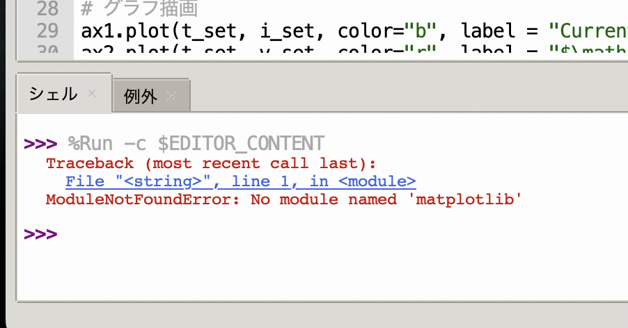
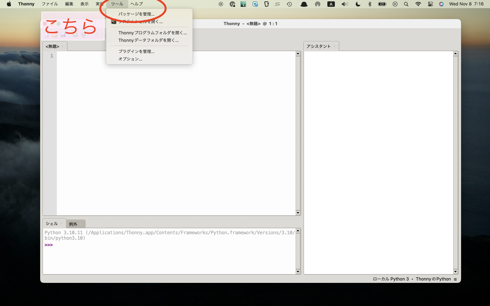
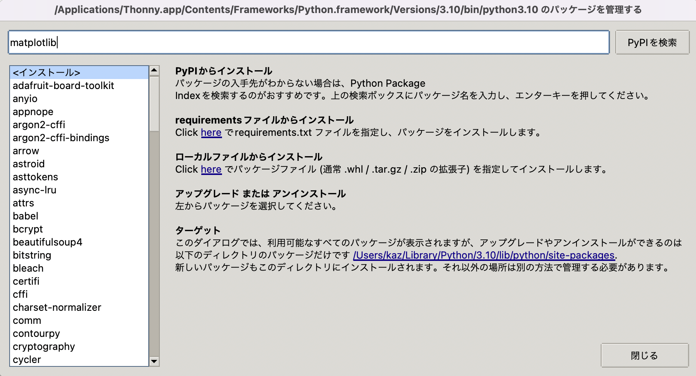
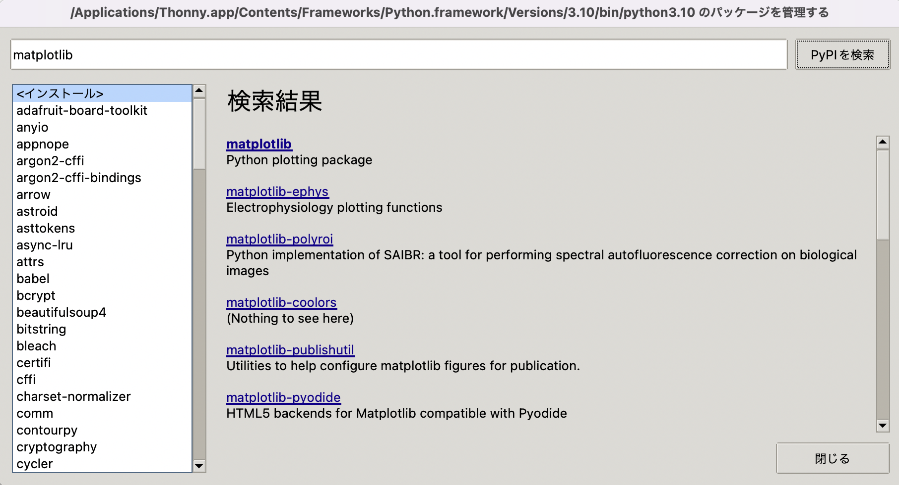
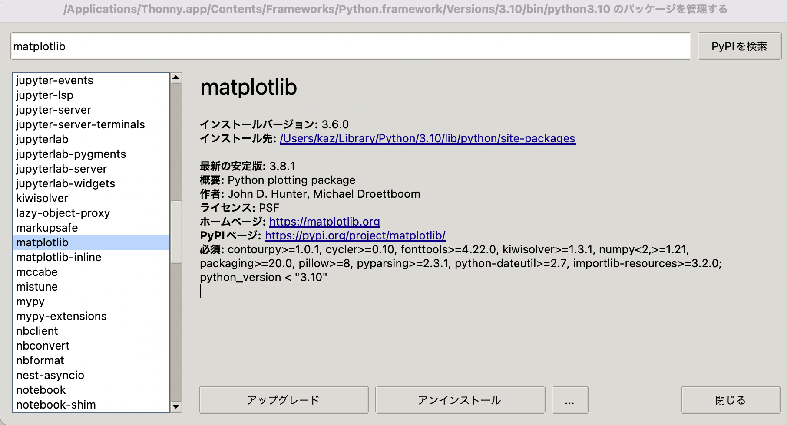

# Pythonでグラフが表示されない場合の対処法

<div class="meta-info">

**Create date:** 2023-11-02  
**Modified date:** 2023-11-08

</div>

```admonish note
2023-11-08追記：Thonnyで「ツール > パッケージ管理」の場所を明記
```

お手元のThonnyで`matplotlib`がインポートされていないかもしれません．
実行しても以下のようなエラーメッセージが出る場合があります：



## 1. インポート文の確認

まずはプログラムの先頭に以下が記載されているか確認してください：

```python
import matplotlib.pyplot as plt
```

スペルミスがないかも確認してください．

## 2. matplotlibライブラリのインストール

`matplotlib`のライブラリがインストールされていない可能性があります．
`Thonny`でプログラムを書いている場合は，以下の手順でライブラリをインストールしましょう．

### 手順1: パッケージ管理を開く
画面上部の`ツール > パッケージを管理`を開きます．



### 手順2: matplotlibを検索
以下の検索画面が開くので`matplotlib`を検索します．



### 手順3: matplotlibを選択
出てきたリストから`matplotlib`を選びます．



### 手順4: インストール実行
インストールボタンを押してください（以下の画面ではアップグレードになっています）．


